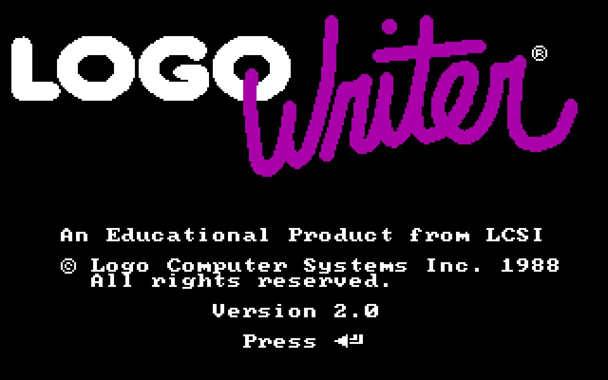
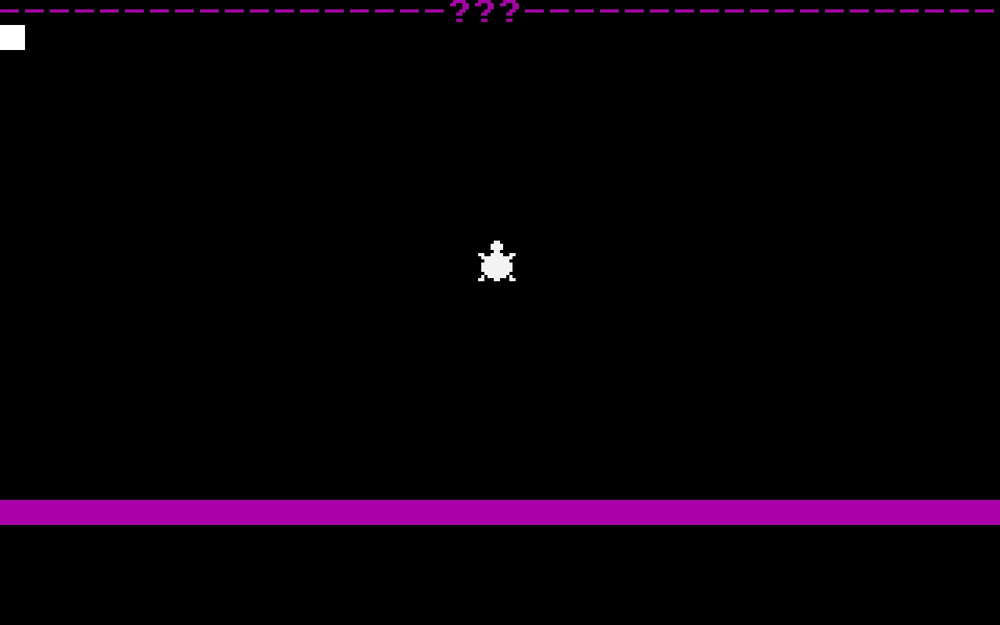

Hi, I’m Luciano, a guy who loves to solve problems; that kind of problem you need to keep thinking about. I like to solve computer science and math problems. I don’t know if that makes me a scientist, but I would like to be one.

My story began some years ago. At school, I thought I had some particular skill for numbers; I’m not a genius, but I was good at math and other subjects. I thought I was good because I didn’t have to study to obtain a perfect score, but I didn’t know if I liked it.

I didn’t know about programming or computer science until high school. My first meeting with a computer program was with *LogoWriter*; this program is about moving a  turtle from the middle of the screen to whatever place, following a sequence of instructions such as right 90, forward 10; the turtle turns and moves forward on the screen drawing a line with 10px length. It was the best thing that I had ever done. It was exciting, and  I knew that the computer could do more than draw a line, so I would have liked to do more.

I wasted much time doing nothing but didn’t have anything to do. When I started college, I met people who opened my mind to the computer science world. I learned I like computer science and math, and programming is like magic. Math and computer science are very close, but many people who love programming may hate math.

Computer science is constantly growing, and computer scientists are always learning new things. This fact made me a person who loves learning. I said programming is like magic because the programmer can tell the computer what and how to do something. The computer executes This entire process so fast that a user (a muggle) knows nothing about it.

A day without learning or programming something is a day being a muggle. I need to improve myself; I need to solve problems every day. ***Muggle days are not bad, but I like to do magic***.

  
  

