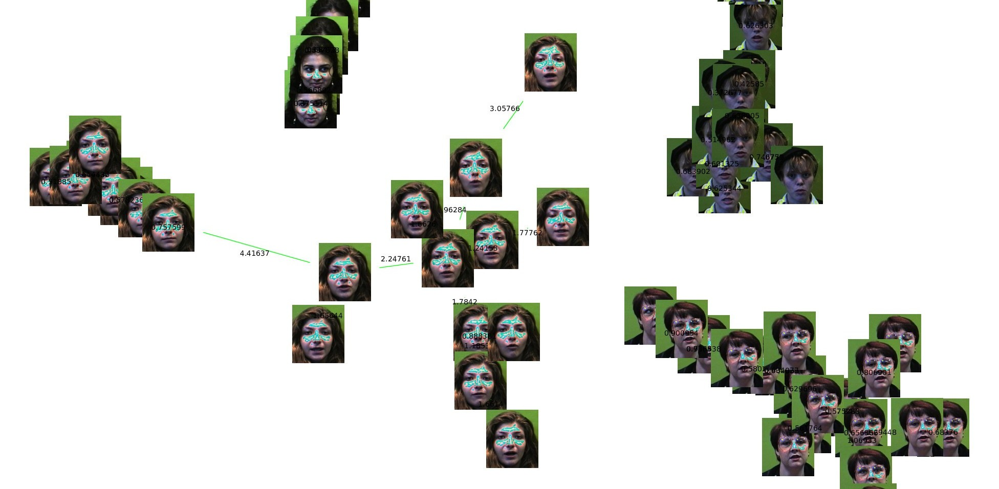

### Abstract

This research proposes a grouping of faces using a minimum spanning tree. The Prim’s algorithm is optimized using the structure Soft Heap as priority queue, and tests are done to check its efficiency compared to Prim’s algorithm with a Fibonacci Heap as queue priority. The characteristic vector is obtained by the Haar wavelet, and for the distances between images are used Euclidean distance between their feature vectors.

[Download paper here](https://goo.gl/AUn6E4)

BibTeX:

```
@InProceedings{LFR12,
    author       = { {Lopez del Alamo}, Cristian J. and {Fuentes Perez}, Lizeth J. and {Romero Calla}, Luciano A. },
    title        = { Agrupamiento por Similitud de Imágenes mediante árbol de Expansión Mínima y Soft Heap },
    booktitle    = { Encuentro Chileno de Computación, Jornadas Chilenas de Computación },
    year         = { 2012 }
}
```
