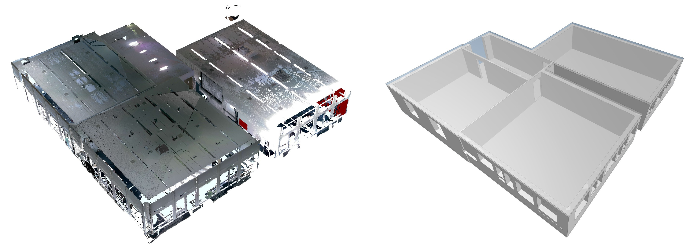

### Abstract

We present a pipeline to automatically generate a CAD model from input scans, which involves extracting all relevant information from the input 3D scans, such as wall locations, door and window outlines, as well as room dimensions. Using this information we create a 2D floor plan and eventually a full 3D model of the (interior) space, encoded in the standard IFC format.

**DOI:** [10.1145/siggraph.3603651](https://doi.org/10.1145/3588028.3603651)


BibTeX:

```
@inproceedings{10.1145/3588028.3603651,
author = {B\"{o}hmer-Mzee, Adilla and Fuentes Perez, Lizeth Joseline and Pajarola, Renato},
title = {Automatic Architectural Floorplan Reconstruction},
year = {2023},
isbn = {9798400701528},
publisher = {Association for Computing Machinery},
address = {New York, NY, USA},
url = {https://doi.org/10.1145/3588028.3603651},
doi = {10.1145/3588028.3603651},
booktitle = {ACM SIGGRAPH 2023 Posters},
articleno = {23},
numpages = {2},
keywords = {3D reconstruction, point cloud data},
location = {Los Angeles, CA, USA},
series = {SIGGRAPH '23}
}
```

