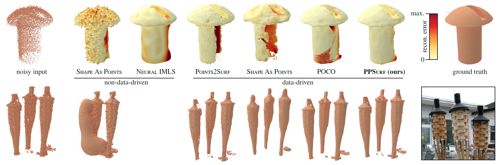

### Abstract

3D surface reconstruction from point clouds is a key step in areas such as content creation, archaeology, digital cultural heritage, and engineering. Current approaches either try to optimize a non-data-driven surface representation to fit the points, or learn a data-driven prior over the distribution of commonly occurring surfaces and how they correlate with potentially noisy point
clouds. Data-driven methods enable robust handling of noise and typically either focus on a \emph{global} or a \emph{local} prior, which trade-off between robustness to noise on the global end and surface detail preservation on the local end. We propose \name as a method that combines a global prior based on point convolutions and a local prior based on processing local point cloud patches. We show that this approach is robust to noise while recovering surface details more accurately than the current state-of-the-art.

**DOI:** [10.1111/cgf.15000](https://doi.org/10.1111/cgf.15000)<br/>


BibTeX:

```
@article{EFHGPW:24,
author    = {Erler, Philipp and {Fuentes Perez}, Lizeth and Hermosilla, Pedro and Guerrero, Paul and Pajarola, Renato and Wimmer, Michael},
title     = {PPSurf: Combining Patches and Point Convolutions for Detailed Surface Reconstruction},
journal   = {Computer Graphics Forum},
volume    = {43},
number    = {1},
articleno = {e15000},
doi       = {10.1111/cgf.15000},
year      = {2024}
}

```

