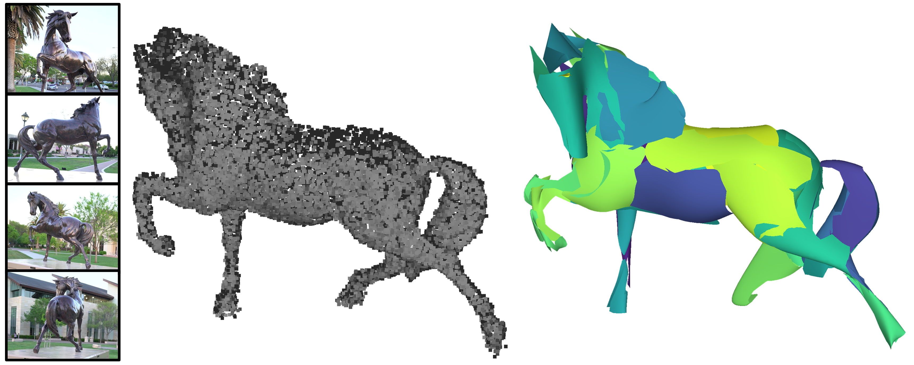

### Abstract

NURBS surfaces are compact parametric representations widely used in Computer-Aided Design (CAD) modeling. Decomposing raw 3D data measurements into a set of such elements is a challenging problem that existing methods approach by learning from CAD databases to both segment synthetic data and fit parametric shapes on each segment. Unfortunately, these methods generalize poorly to raw data measurements, with low robustness to imperfect data and complex objects and low scalability. To address this issue, we propose NURBSFit, an algorithm that fits NURBS surfaces to unorganized 3D point clouds, such as those generated by laser and photogrammetry acquisition systems. Starting with a fine configuration of planar patches that approximate the object geometry, our algorithm performs merging operations that progressively regroup pairs of adjacent patches into fewer, more expressive NURBS surfaces. This process is designed to be both robust and performant with a series of technical ingredients that include an energy that controls the global quality of a configuration of NURBS surfaces and an efficient ordering of the merging operations based on a cost-efficient quadric surface fitting analysis. We show the potential of our algorithm on both synthetic and real-world data and its efficiency against existing primitive fitting methods with results both simpler and geometrically more accurate. Our implementation is available at: [https://github.com/lizOnly/nurbsfit](https://github.com/lizOnly/nurbsfit).

**DOI:** [10.1109/3DV69130.2026.00046](https://doi.org/10.1109/3DV69130.2026.00046)<br/>


BibTeX:

```
@inproceedings{FLP:26,
author    = {{Fuentes Perez}, Lizeth J. and Lafarge, Florent and Pajarola, Renato},
title     = {NURBSFit: Robust Fitting of NURBS Surfaces to Point Clouds},
booktitle = {2026 International Conference on 3D Vision (3DV)},
pages     = {417--426},
doi       = {10.1109/3DV69130.2026.00046},
year      = {2026}
}

```
